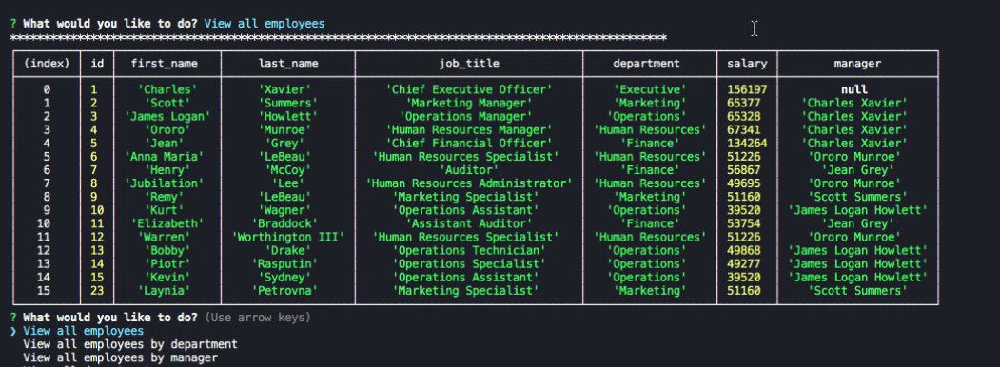
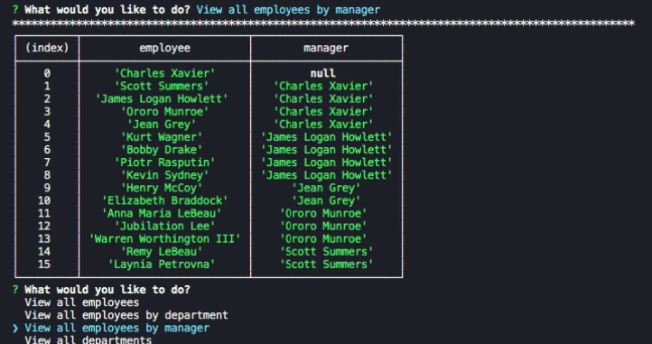

# Employee Management System

## Table of Contents
*  [Description](#description)
*  [User Story](#user-story)
*  [Features of the Application](#features-of-the-application)
*  [Preview of the Employee Management System](#preview-of-the-employee-management-system)
*  [Links](#links)
*  [Installation](#installation)
*  [Usage](#usage)
*  [License](#license)
*  [Contributing](#contributing)
*  [Questions](#questions)

## Description

**C**ontent **M**anagement **S**ystems are user-friendly interfaces that make it easy for non-developers to view and interact with information stored in databases. Content Management Systems lets its users create, edit, and publish information in a dynamic fashion. It allows users without any coding knowledge or coding experience to modify and edit content.

The Employee Management System is a command-line application that builds a solution for managing a company's employees using node, inquirer, and MySQL. The application functions so that its users can create, edit, and organize their company's information.

## User Story
~~~
AS A business owner  
I WANT to be able to view and manage the departments, roles, and employees in my company  
SO THAT I can organize and plan my business.  
~~~

## Features of the Application
~~~
GIVEN an application that allows the user to view and manage the departments, roles, and employees in their company  
WHEN I interact with the command line interface,
THEN I am given options to view my employees (and details regarding their employment (roles, salaries, managers, departments, and id number)), add or remove an employee to my company, add a new department to my company, and update details of an existing employee (the employee's name, manager, or job title).  
~~~

## Preview of the Employee Management System

The following animation demonstrates the complete application functionality:

To download the video file of the complete application functionality - as it is too large of a file and cannot be viewed on Github - you may do so [here](https://github.com/rh9891/EmployeeManagementSystem/blob/master/assets/images/applicationFunctionalityPreview.mp4).

The following animation provides a closer look of the application's menu:

The following image demonstrates the application's capability of viewing all of its current employees and details regarding their employment:

The following image demonstrates the application's capability to view all of its current employees by order of their managers:

The following image demonstrates the application's capability to view all of its current employees through departmental grouping:

The following animations demonstrate the application's capability of adding a new employee to the current employee database and updating the manager for an employee. 

The user is prompted by the command line interface to input responses about the new employee, such as their first name, last name, and job title. The user saves the details of the new employee into the current employee database. The id number is automatically generated for the new employee, but the new employee is without a manager as it has yet to be assigned.

The user then updates the manager information for the employee - as it is currently "null" - so that it is accurate to their job title.

The following image is a diagram of the schema that demonstrates the variables for each table, including their indexes, constraints, and foreign keys:

## Links

[Github Repository](https://github.com/rh9891/EmployeeManagementSystem)

## Installation

The application requires the following dependencies and/or package managers:
~~~
npm install inquirer
~~~

~~~
npm install mysql
~~~

~~~
npm install console.table
~~~

## Usage

An example of usage when first launching the application to access it from the command line:
~~~
node app.js
~~~

## License

This application does not currently have any licenses.

The user is not permitted to use, modify, or share any parts of it. Though the code for this application is hosted on Github, where you are allowed to view and fork the code, this does not imply that the user is permitted to use, modify, or share the contents of this application for any purpose.

## Contributing

If you would like to contribute to this repository, please contact me via [Github](https://github.com/rh9891).

## Questions

If you have any questions, comments, or issues regarding this command line interface application, please do not hesitate to contact me through [Github](https://github.com/rh9891).